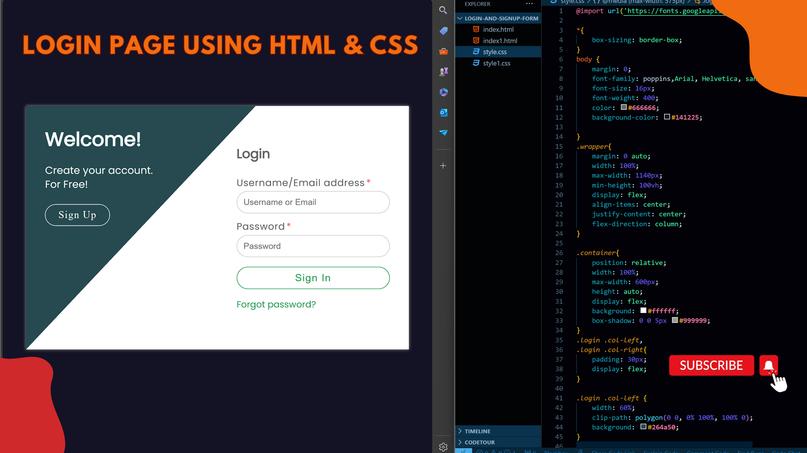

# Login-Signup-Page-Using-HTML-and-CSS
This repository contains a simple login and signup page built using HTML and CSS. The page has a responsive design and is optimized for both desktop and mobile devices.

# Screenshots

calculator

# Tutorial is available on youtube channel 
click on the link to see :- ([Open in Youtube]())

# Features

Responsive design for desktop and mobile devices
Simple and clean layout
Customizable colors and fonts
Validation for email and password fields
Password strength indicator

# Usage

To use this login and signup page, simply clone the repository and open the index.html file in a web browser. You can then interact with the page by filling out the forms and submitting them.

# snake.coding
We create a project each 4 days with voting on our <a href="https://youtube.com/@snakecoding_12" target="_blank">Youtube</a> channel.
You can vote for upcoming projects on our channel **community** page :wink:

